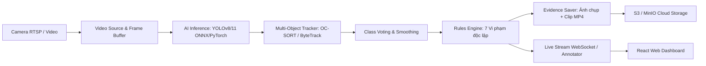

# 🚦 Digital City Expand — Traffic Vision AI Edge & Smart City Dashboard

> **Hệ thống thị giác máy tính giám sát giao thông thông minh thời gian thực trên thiết bị biên (Edge AI Box / Server), tích hợp Web Dashboard điều hành trực tiếp, công cụ hiệu chuẩn camera đa phương thức, phát hiện 7+ loại vi phạm giao thông và trích xuất bằng chứng hình ảnh/video tự động.**

[](https://python.org)
[](https://fastapi.tiangolo.com)
[](https://react.dev)
[](https://onnxruntime.ai)
[](https://docker.com)
[](tests/)

---

## 📑 Mục lục
1. [Tổng quan hệ thống](#-tổng-quan-hệ-thống)
2. [Các vi phạm giao thông phát hiện (7 Rules)](#-các-vi-phạm-giao-thông-phát-hiện-7-rules)
3. [Kiến trúc kỹ thuật](#-kiến-trúc-kỹ-thuật)
4. [Cấu trúc mã nguồn](#-cấu-trúc-mã-nguồn)
5. [Cài đặt & Chuẩn bị môi trường](#-cài-đặt--chuẩn-bị-môi-trường)
6. [Hướng dẫn khởi chạy](#-hướng-dẫn-khởi-chạy)
   - [A. Chạy Web Dashboard & API Server](#a-chạy-web-dashboard--api-server)
   - [B. Chạy AI Pipeline trực tiếp (CLI)](#b-chạy-ai-pipeline-trực-tiếp-cli)
   - [C. Triển khai Docker (Edge Device & Multi-Camera)](#c-triển-khai-docker-edge-device--multi-camera)
7. [Hướng dẫn hiệu chuẩn Camera (Calibration)](#-hướng-dẫn-hiệu-chuẩn-camera-calibration)
   - [Hiệu chuẩn đo tốc độ 4 điểm trực tiếp (Quy chuẩn mới)](#-quy-chuẩn-hiệu-chuẩn-tốc-độ-4-điểm-trực-tiếp)
8. [Quản lý bằng chứng & Giám sát thiết bị biên](#-quản-lý-bằng-chứng--giám-sát-thiết-bị-biên)
9. [Kiểm thử tự động (Testing)](#-kiểm-thử-tự-động-testing)

---

## 🌟 Tổng quan hệ thống

**Digital City Expand** là giải pháp phần mềm thị giác máy tính trọn gói được thiết kế tối ưu cho các thiết bị biên (*Edge AI Box, Jetson Orin/Xavier, Industrial IPC, x86 Server*):
* **Kiến trúc Per-Camera**: Mỗi camera là một thực thể độc lập (*1 camera = 1 process / 1 container*), không gây nghẽn luồng xử lý chéo nhau.
* **Xử lý đa luồng & độ trễ cực thấp**: Hỗ trợ nguồn vào RTSP camera giao thông, video tệp tin hoặc webcam trực tiếp. Tự động phục hồi kết nối (reconnect) khi rớt mạng.
* **Hệ thống điều hành trực quan**: Web Dashboard hiện đại (React 18 + Tailwind CSS + IBM Plex Font) cho phép xem luồng trực tiếp, quản lý camera, trực quan hóa vi phạm và phân tích biểu đồ thống kê thời gian thực.
* **Công cụ hiệu chuẩn 2 chiều đồng bộ**: Có thể vẽ làn, vạch dừng, hộp đèn và vùng đo tốc độ ngay trên trình duyệt (Web) hoặc qua cửa sổ đồ họa cục bộ (`draw_lines.py`).

---

## 🚨 Các vi phạm giao thông phát hiện (7 Rules)

Hệ thống cung cấp sẵn bộ quy tắc (*Rules Engine*) hoạt động theo kiến trúc plugin mở rộng:

| Mã | Tên vi phạm | Quy chuẩn kiểm tra & Thuật toán | Bằng chứng xuất ra |
|:---:|---|---|---|
| **1** | **Đi ngược chiều**<br>`wrong_way` | Tính tích vô hướng giữa vector di chuyển của xe và vector cho phép (`allowed_vec`) hoặc kiểm tra thứ tự cắt qua cặp vạch ảo song song (`line_pair`). | Snapshot xe + bounding box vi phạm + Video clip |
| **2** | **Cấm quay đầu**<br>`no_uturn` | Kiểm tra chuỗi trạng thái chuyển tiếp hướng xe di chuyển cắt qua 2 vạch ảo đối xứng trong vùng đa giác làn đường. | Snapshot điểm bắt đầu & kết thúc quay đầu + Clip MP4 |
| **3** | **Đi vào đường cấm**<br>`no_entry_road` | Kiểm tra loại phương tiện bị cấm (`banned_classes`: xe tải, xe khách, ...) đi vào đa giác đường cấm trong khung giờ quy định (`active_hours`). | Snapshot xe vi phạm trong khung giờ cấm + Clip MP4 |
| **4** | **Vượt đèn đỏ & Đè vạch**<br>`red_light_running`<br>`stop_line` | Nhận diện trạng thái đèn giao thông từ vùng ROI (Đỏ/Vàng/Xanh), phát hiện xe cắt qua vạch dừng khi đèn đỏ và xác thực xe tiến vào vùng giải tỏa ngã tư (`intersection_clearance_zone`). | Snapshot trạng thái đèn đỏ + vị trí xe đè vạch + Clip MP4 |
| **5** | **Chạy quá tốc độ**<br>`speeding` | **Quy chuẩn 4 điểm trực tiếp**: Chiếu tọa độ bánh xe sang mặt phẳng mét thông qua ma trận Homography $H$, bù trừ rung lắc camera (Optical Flow Background Shake), làm mịn vận tốc cửa sổ trượt và so khớp tốc độ giới hạn (`limit_kmh`). | Snapshot tốc độ đo được (km/h) + Quỹ đạo di chuyển + Clip MP4 |
| **6** | **Cấm dừng / đỗ xe**<br>`no_parking` | Giám sát xe đứng yên hoặc di chuyển dưới ngưỡng tốc độ trong vùng cấm dừng đỗ vượt quá thời gian cho phép (`dwell_s`). | Snapshot thời điểm vào và thời điểm hết hạn đỗ + Clip MP4 |
| **7** | **Tụ tập đông người**<br>`no_gathering` | Đếm số lượng người đồng thời trong vùng cấm tụ tập vượt ngưỡng `min_persons` trong khoảng thời gian `dwell_s` (chạy model phụ tối ưu nhẹ). | Snapshot đám đông kèm số lượng người phát hiện + Clip MP4 |

---

## 🏗 Kiến trúc kỹ thuật



1. **Inference**: Sử dụng ONNX Runtime tối ưu với CUDA Execution Provider (hoặc CPU fallback). Hỗ trợ tải mô hình `weights/best_15thg9.onnx`.
2. **Temporal Tracker & Class Voting**: Bộ lọc `class_voting.py` giải quyết hiện tượng nhảy class giữa các khung hình (ví dụ: nhảy qua lại giữa `car`, `truck`, `bus`), đảm bảo phân loại phương tiện chính xác tuyệt đối trước khi kết luận vi phạm.
3. **Evidence System**: Khi phát hiện hành vi vi phạm, hệ thống tự động lưu trữ ảnh chất lượng cao kèm thông tin ngày giờ, tọa độ, biển số, tốc độ và video clip trích xuất 5-10 giây trước/sau thời điểm xảy ra sự việc.

---

## 📁 Cấu trúc mã nguồn

```text
digital-city-expand/
├── backend/                    # FastAPI Backend Gateway & Web Services
│   ├── app/
│   │   ├── routers/            # API: cameras, events, live stream, calibration, analytics
│   │   ├── services/           # Background services, pipeline runners, job queue
│   │   └── main.py             # FastAPI App entrypoint (Port 8000)
├── frontend/                   # React 18 + Vite + Tailwind CSS Operations Dashboard
│   ├── src/
│   │   ├── pages/              # Dashboard, LiveStream, CalibratePage, Violations, Cameras
│   │   ├── components/         # SVG Canvas, HUD, Video Player, Data Tables
│   └── package.json
├── configs/                    # Thư mục cấu hình Camera chuẩn hóa
│   ├── active.yaml             # Cấu hình camera hiện tại đang chạy (Canonical)
│   ├── base.yaml               # Cấu hình mặc định chung
│   └── cameras/                # File cấu hình riêng cho từng camera (cam_01.yaml, ...)
├── src/                        # Thư viện lõi (Core Pipeline & Business Logic)
│   ├── business/rules/         # Plugin 7 luật vi phạm giao thông
│   │   ├── registry.py         # Điểm đăng ký động các luật
│   │   ├── wrong_way.py        # Luật đi ngược chiều
│   │   ├── no_uturn.py         # Luật cấm quay đầu
│   │   ├── no_entry_road.py    # Luật đi vào đường cấm
│   │   ├── red_light.py        # Luật vượt đèn đỏ
│   │   ├── stop_line.py        # Luật đè vạch dừng
│   │   ├── speeding.py         # Luật đo tốc độ phương tiện (Homography)
│   │   ├── no_parking.py       # Luật cấm dừng/đỗ xe
│   │   └── no_gathering.py     # Luật tụ tập đông người
│   ├── calibration/            # Logic menu hiệu chuẩn & trạng thái vẽ
│   ├── camera/                 # RTSP Stream reader, reconnect, time synchronization
│   ├── inference/              # Wrapper ONNX Runtime, CUDA, TensorRT, PyTorch
│   ├── monitoring/             # Heartbeat, Edge device watchdog
│   ├── pipeline/               # Runner điều phối khung hình và các luật
│   ├── storage/                # Lưu ảnh/video bằng chứng, đồng bộ S3 / MinIO
│   ├── tracking/               # OC-SORT, ByteTrack & Class Voting
│   └── utils/                  # Homography, geometry, visualizer vẽ HUD
├── scripts/                    # Kịch bản vận hành & công cụ CLI
│   ├── calibrate/
│   │   └── draw_lines.py       # Công cụ vẽ vạch & hiệu chuẩn GUI OpenCV cục bộ
│   └── benchmark_onnx.py       # Đánh giá tốc độ FPS mô hình AI
├── weights/                    # Trọng số mô hình AI (*.onnx, *.pt)
├── tests/                      # Bộ kiểm thử tự động toàn diện (140+ unit tests)
├── assets/                     # Video mẫu kiểm thử (uturn.mp4, speed1.mp4, ...)
├── Dockerfile                  # Dockerfile tối ưu kích thước cho thiết bị biên
├── docker-compose.yml          # Compose file triển khai 1 camera container
├── deploy.sh                   # Script quản lý multi-container per-camera
├── pipeline.py                 # File thực thi Pipeline CLI chính
└── start_dashboard.sh          # Kịch bản khởi chạy đồng thời Web Dashboard & API
```

---

## 💻 Cài đặt & Chuẩn bị môi trường

### 1. Yêu cầu hệ thống
* **Hệ điều hành**: Linux (Ubuntu 20.04/22.04/24.04 khuyên dùng) hoặc macOS / Windows WSL2.
* **Python**: Python 3.10, 3.11 hoặc 3.12.
* **Node.js**: Node.js 18+ và npm (dành cho Web Dashboard).
* **Hardware**: CPU tối thiểu 4 lõi; Khuyên dùng GPU NVIDIA (GTX 1650 trở lên hoặc Jetson Orin) để đạt tốc độ xử lý 30+ FPS.

### 2. Thiết lập môi trường Python
```bash
# 1. Clone repository
git clone https://github.com/QuangTocDo/edge_ai_box.git
cd edge_ai_box

# 2. Tạo và kích hoạt môi trường ảo (virtualenv)
python3 -m venv .venv
source .venv/bin/activate

# 3. Cài đặt các gói phụ thuộc
pip install --upgrade pip
pip install -r requirements.txt

# 4. Sao chép cấu hình môi trường mẫu
cp .env.example .env
```

### 3. Thiết lập Web Frontend
```bash
cd frontend
npm install
cd ..
```

---

## 🚀 Hướng dẫn khởi chạy

### A. Chạy Web Dashboard & API Server

Chỉ cần thực thi một lệnh duy nhất:
```bash
./start_dashboard.sh
```
Hệ thống sẽ tự động khởi chạy:
* **Backend API Gateway**: `http://127.0.0.1:8000` (Swagger docs tại `http://127.0.0.1:8000/docs`)
* **Web Operations Dashboard**: `http://127.0.0.1:5173`

> Trên giao diện Web Dashboard, bạn có thể:
> - Theo dõi luồng giám sát trực tiếp kèm khung nhận diện và thống kê vi phạm.
> - Cấu hình camera, vẽ và lưu các vùng kiểm soát, vạch dừng, đèn tín hiệu.
> - Tra cứu danh sách vi phạm, tải ảnh snapshot bằng chứng và clip trích xuất.

---

### B. Chạy AI Pipeline trực tiếp (CLI)

Bạn có thể chạy độc lập pipeline phân tích trên file video hoặc luồng RTSP từ dòng lệnh:

```bash
# 1. Chạy với file cấu hình chuẩn (configs/active.yaml)
python pipeline.py --config configs/active.yaml

# 2. Chạy thử nghiệm video với giao diện trực quan (GUI Window)
python pipeline.py --config configs/active.yaml --source assets/speed1.mp4

# 3. Chạy không hiển thị màn hình (Headless Mode) - Tối đa hóa FPS trên máy chủ/biên
python pipeline.py --config configs/active.yaml --source assets/speed1.mp4 --no-show

# 4. Giảm kích thước ảnh đầu vào để tăng tốc xử lý (ví dụ: imgsz 480)
python pipeline.py --config configs/active.yaml --source assets/speed1.mp4 --no-show --imgsz 480

# 5. Xuất video kết quả đã vẽ bounding box và cảnh báo ra file
python pipeline.py --config configs/active.yaml --source assets/speed1.mp4 --save output_result.mp4 --no-show

# 6. Bật giải thích chi tiết logic phân tích (Debug Rules)
python pipeline.py --config configs/active.yaml --source assets/speed1.mp4 --debug-rules
```

---

### C. Triển khai Docker (Edge Device & Multi-Camera)

#### 1. Chạy 1 Camera với Docker Compose
```bash
# Build và chạy ngầm
docker compose up --build -d

# Xem log thời gian thực
docker compose logs -f

# Dừng container
docker compose down
```

#### 2. Quản lý nhiều Camera độc lập (`deploy.sh`)
```bash
# Build image chung cho các camera
./deploy.sh build

# Khởi chạy một camera cụ thể
./deploy.sh start configs/cameras/cam_01.yaml

# Khởi chạy tất cả camera có trong thư mục configs/cameras/
./deploy.sh start-all

# Kiểm tra trạng thái hoạt động (Healthcheck / Heartbeat)
./deploy.sh status

# Xem log của một camera cụ thể
./deploy.sh logs cam_01
```

---

## 🎯 Hướng dẫn hiệu chuẩn Camera (Calibration)

Hệ thống hỗ trợ 2 cách hiệu chuẩn camera linh hoạt:

### Cách 1: Hiệu chuẩn trên Web Dashboard (Khuyên dùng)
1. Truy cập tab **Hiệu chuẩn (Calibrate)** trên Web Dashboard (`http://localhost:5173/calibrate`).
2. Chọn camera cần hiệu chuẩn.
3. Chọn quy tắc cần vẽ ở menu bên trái (Đi ngược chiều, Vượt đèn đỏ, Đo tốc độ, Cấm đỗ, ...).
4. Thực hiện thao tác trực tiếp trên khung hình camera và bấm **Lưu cấu hình**.

---

### Cách 2: Hiệu chuẩn bằng công cụ Desktop (`draw_lines.py`)
Mở công cụ vẽ trên ảnh chụp camera hoặc video:
```bash
python scripts/calibrate/draw_lines.py assets/speed1.mp4 --config configs/active.yaml
```

**Bảng phím tắt điều khiển:**
* Phím số `1` đến `7`: Chọn quy tắc vi phạm tương ứng cần cấu hình.
* `p`: Bắt đầu vẽ đa giác (Polygon).
* `l`: Bắt đầu vẽ vạch kẻ (Line).
* `a`: Ghép cặp 2 vạch ảo (Line Pair) để kiểm tra chiều di chuyển.
* `r`: Kéo thả chuột tạo vùng ROI hộp đèn tín hiệu giao thông.
* `f`: Đảo chiều hướng đi của vạch kẻ đang chọn.
* `x`: Xóa vạch kẻ hoặc đa giác đang chọn.
* `s`: Lưu ngay cấu hình vào file YAML.
* `Esc`: Hủy thao tác đang vẽ dở.

---

### ⚡ Quy chuẩn hiệu chuẩn tốc độ 4 điểm trực tiếp

Nhằm khắc phục tình trạng méo góc chiếu phối cảnh khi đường cong hoặc cự ly xa, hệ thống áp dụng **quy trình 4 điểm tinh gọn trực tiếp**:

```text
       P4 (Đầu ra - Trái) ----------- P3 (Đầu ra - Phải)
              |                               |
              |       ▲ Hướng xe di chuyển    |
              |       |   (M12 -> M34)        |  Chiều dài L (m)
              |                               |
       P1 (Đầu vào - Trái) ---------- P2 (Đầu vào - Phải)
                    Chiều rộng W (m)
```

1. **Thứ tự chấm đúng 4 điểm**:
   * **$P_1$ (Đầu vào - Trái)** và **$P_2$ (Đầu vào - Phải)**: Chiều rộng $W$ đầu làn đón xe vào $\to (0, 0)$ và $(W, 0)$.
   * **$P_3$ (Đầu ra - Phải)** và **$P_4$ (Đầu ra - Trái)**: Chiều rộng $W$ đầu làn xe thoát ra $\to (W, L)$ và $(0, L)$.
2. **Tự động hóa toàn diện**:
   * Hệ thống tự động thiết lập ma trận Homography $H$ chuyển đổi pixel sang mét mặt đường.
   * Tự động sinh vector hướng xe `road_dir = [0.0, 1.0]` nối từ trung điểm $M_{12} = \frac{P_1 + P_2}{2}$ tới $M_{34} = \frac{P_3 + P_4}{2}$.
   * Người dùng chỉ cần nhập 3 thông số thực tế: **Chiều rộng $W$ (m)**, **Chiều dài $L$ (m)**, và **Tốc độ giới hạn (km/h)**.

---

## 📦 Quản lý bằng chứng & Giám sát thiết bị biên

* **Cấu trúc thư mục bằng chứng**:
  ```text
  evidence/
  └── <CAMERA_ID>/
      └── date=YYYY-MM-DD/
          └── <LOẠI_VI_PHẠM>/
              ├── <TRACK_ID>_<TIMESTAMP>_snapshot.jpg
              └── <TRACK_ID>_<TIMESTAMP>_clip.mp4
  ```
* **Tự động giải phóng bộ nhớ (Disk Pruning)**:
  Cấu hình `retention_days: 7` trong file YAML. Định kỳ mỗi 300 giây hệ thống sẽ tự động quét và xóa các thư mục bằng chứng cũ hơn số ngày quy định để tránh tràn đĩa cứng thiết bị biên.
* **Đồng bộ S3 / MinIO**:
  Chạy worker nền `python s3_worker.py --camera CAM_01` để tự động đẩy ảnh và clip bằng chứng lên Cloud Storage khi có kết nối mạng.
* **Watchdog & Healthcheck**:
  Pipeline liên tục cập nhật file heartbeat tại `data/heartbeat_<CAMERA_ID>`. Docker Container sử dụng `HEALTHCHECK` kiểm tra tính sống còn mỗi 30 giây (nếu heartbeat cũ hơn 90 giây sẽ tự động kích hoạt khởi động lại).

---

## 🧪 Kiểm thử tự động (Testing)

Hệ thống được trang bị bộ unit test và integration test bao phủ toàn bộ các module xử lý:

```bash
# Kích hoạt môi trường và chạy toàn bộ kiểm thử
source .venv/bin/activate
pytest tests/ -v
```

**Kết quả kiểm thử:**
```text
============================= test session starts ==============================
collected 140 items

tests/test_architecture_improvements.py .....                            [  3%]
tests/test_class_voting.py ...                                           [  5%]
tests/test_color.py .......                                              [ 10%]
tests/test_config_loader.py ............                                 [ 19%]
tests/test_draw_menu.py .........                                        [ 25%]
tests/test_draw_state.py .............                                   [ 35%]
tests/test_evidence.py ......                                            [ 39%]
tests/test_geometry.py .                                                 [ 40%]
tests/test_homography.py ...                                             [ 42%]
tests/test_line_config.py ...........                                    [ 50%]
tests/test_polygon.py ...                                                [ 52%]
tests/test_registry.py ....                                              [ 55%]
tests/test_rule_no_entry.py .......                                      [ 60%]
tests/test_rule_no_gathering.py ....                                     [ 62%]
tests/test_rule_no_uturn.py .......                                      [ 67%]
tests/test_rule_red_light.py ...........                                 [ 75%]
tests/test_rule_speeding.py .......                                      [ 80%]
tests/test_rule_stop_line.py ...........                                 [ 88%]
tests/test_rule_wrong_way.py ....                                        [ 91%]
tests/test_signals.py ..                                                 [ 92%]
tests/test_view_upload.py .......                                        [ 97%]
tests/test_visualizer.py ...                                             [100%]

============================= 140 passed in 15.7s ==============================
```

---

## 📖 Tài liệu liên quan

* [Hướng dẫn chạy chi tiết (Local & RTSP)](docs/HUONG_DAN_CHAY.md)
* [Kế hoạch phát triển kiến trúc (Project Plan)](docs/PROJECT_PLAN.md)
* [Quản lý mô hình và phiên bản weights](models/README.md)
* [Quy chuẩn cấu hình YAML](configs/README.md)
