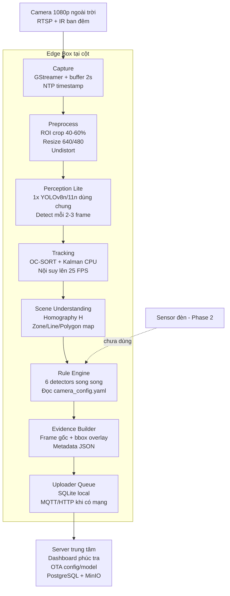
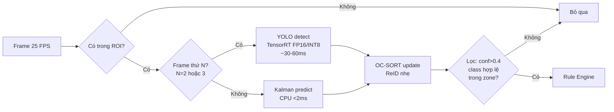
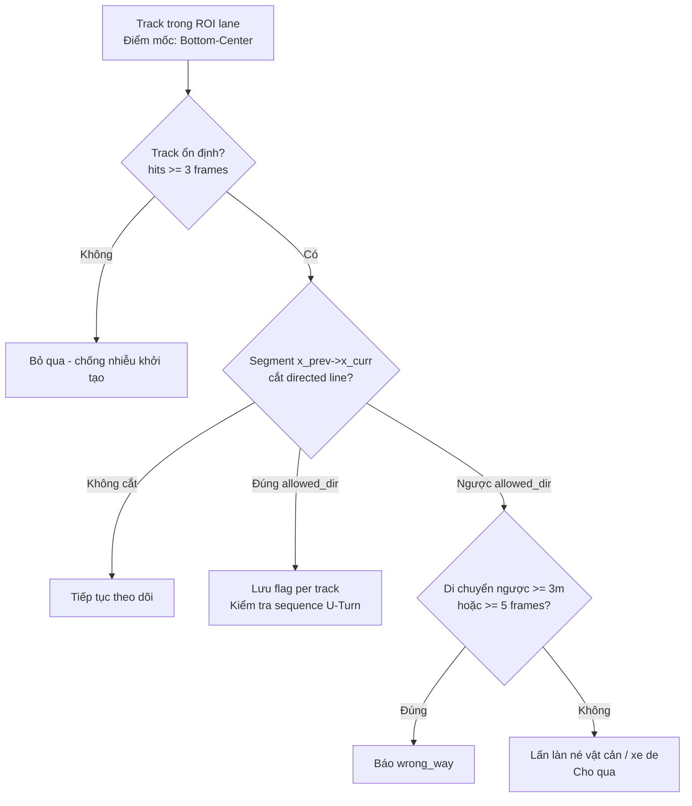
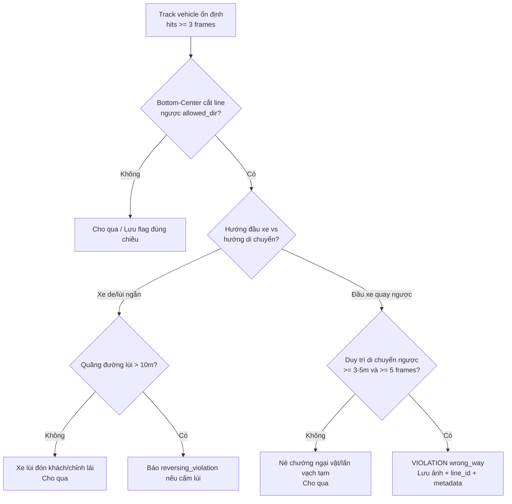
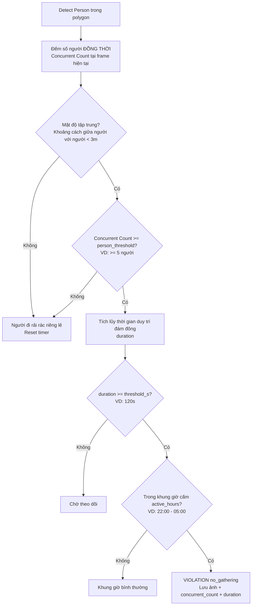

# Dự Án AI Nhận Diện Lỗi Phương Tiện Tham Gia Giao Thông — Tài Liệu Thống Nhất & Kế Hoạch Triển Khai Production

> **Mục tiêu:** Hệ thống AI chạy production, phát hiện vi phạm giao thông ngoài trời, thời gian thực, độ trễ thấp trên thiết bị edge hạn chế.
> **Output:** Ảnh minh chứng tại thời điểm vi phạm (bbox người/phương tiện + thời gian).
> **Trạng thái:** Tài liệu thống nhất sau trao đổi — dùng làm baseline triển khai.

---

## 1. Yêu Cầu Đã Thống Nhất

| # | Hạng mục | Chốt triển khai |
|---|----------|-----------------|
| 1 | **Nơi chạy** | Edge tại chân camera. Số lượng nhiều. Mã camera/GPU cung cấp sau. Thiết kế hardware-agnostic (ONNX abstraction). |
| 2 | **Vượt đèn đỏ** | Phase 1: **detect màu đèn bằng vision** (tối ưu 10 FPS khi đèn vàng, trễ <200ms). Phase 2: nhận tín hiệu cảm biến (interface `TrafficLightProvider`). Tách rõ 2 lỗi: Dừng quá vạch (`stop_line_violation`) vs Vượt đèn đỏ (`red_light_running`). |
| 3 | **Đo tốc độ** | **Pure-vision**: dựa trên thay đổi frame + homography pixel→mét tại điểm tiếp xúc bánh xe (Bottom-Center). Sai số 8–12%, dùng cảnh báo/thống kê luồng giao thông (chưa làm căn cứ lập biên bản phạt hành chính trực tiếp do quy định kiểm định đo lường). |
| 4 | **Output** | **Ảnh chi tiết**: frame gốc full-res + bbox + metadata JSON. Riêng lỗi **vượt đèn đỏ**: bắt buộc xuất **bộ 3 ảnh liên hoàn (Triptych)**: (1) Trước vạch lúc đỏ - (2) Đang đè vạch - (3) Đã vào ngã tư, hoặc clip ngắn 3s MP4 (<1MB) để đảm bảo giá trị pháp lý. |
| 5 | **Môi trường** | Ngoài trời, cả ngày (ngày/đêm/mưa). Yêu cầu **độ trễ thấp** → model nhỏ nhẹ + tối ưu inference (quantize, TensorRT, frame-skipping, ROI). |
| 6 | **Các lỗi MVP** | (a) Đi ngược chiều (lọc xe lùi, lấn làn né vật cản), (b) Đi vào đường cấm (theo loại xe + giờ cấm + lọc xe từ nhà đi ra), (c) Cấm quay đầu (sequence line + quỹ đạo chữ U), (d) Vượt đèn đỏ & dừng quá vạch, (e) Đo tốc độ, (f) Khu vực cấm gồm cấm đỗ xe (spatial anchor memory) + cấm tụ tập (concurrent count). |

### 1.1. Yêu cầu phi chức năng (production)

- Độ trễ từ vi phạm → có ảnh: **< 1.5s** trên edge.
- Inference: **≥ 10–12 FPS detect, 25 FPS track** (nội suy Kalman trên CPU).
- Tự chạy offline mất mạng, lưu local 7 ngày (xoay vòng SQLite), có mạng sync lên server.
- Uptime **≥ 99%**, watchdog tự restart, giảm FPS khi quá nhiệt (>75°C).
- Đồng bộ thời gian **NTP**, sai lệch camera vs logic < 100ms.
- Precision mục tiêu pilot: **> 85%**, False Positive **< 2/h/camera**, còn lại qua human-review.
- **Chuẩn điểm mốc (Ground-truth reference point):** Toàn bộ phép kiểm tra cắt line, homography và containment polygon bắt buộc dùng **Bottom-Center** (điểm tiếp xúc mặt đường của BBox) thay vì Centroid để triệt tiêu sai số góc chiếu phối cảnh 3D→2D.

---

## 2. Kiến Trúc Tổng Thể (Edge-First)



**Nguyên tắc:**

1. **1 detector + 1 tracker dùng chung** cho mọi lỗi (tiết kiệm GPU 3–5x).
2. **AI chỉ ra tracks, Rule Engine ra violation.** Thêm camera mới = sửa config, không sửa code.
3. Server không decode video, chỉ nhận ảnh + metadata → scale ngang bằng cách thêm edge box.

---

## 3. Pipeline Inference Chi Tiết (Tối Ưu Độ Trễ)



### 3.1. Chiến lược model: 1 detector chung + N classifier tí hon (CHỐT)

> **Quyết định:** KHÔNG mỗi task 1 model, KHÔNG 1 multi-task khổng lồ.

```
Frame
  -> [1x Detector chung YOLOv8n/11n]: car/bike/bus/truck/person/traffic-light-box
    -> [Tracker OC-SORT + Kalman CPU] -> Điểm mốc chuẩn: Bottom-Center (x, y_max)
      -> Rule Engine:
         - wrong_way / no_uturn / no_entry_road: geometry + segment intersection + heading verification
         - speed: homography trên Bottom-Center + moving variance anti-shake
         - no_parking: Spatial Anchor Memory (bảo toàn thời gian khi ID-switch)
         - red_light: state-gated line crossing + intersection clearance verification
      -> [Classifier 64x64: light color]: Adaptive 2 FPS (Green/Red) -> 10 FPS (Yellow chuyển Red)
      -> [Classifier 32x32: helmet/no-helmet]: chỉ chạy khi person trong zone
      -> [Crowd: Concurrent persons counting]: đếm số người đồng thời trên frame, không đếm unique ID tích lũy
```

| Phương án | Vấn đề với edge nhiều node |
|-----------|----------------------------|
| Mỗi task 1 detector | 6 lỗi x 6 model = 6x VRAM, FPS 12 -> 2, N lần OTA/retrain, không maintain nổi 100 cột |
| 1 multi-task backbone nhiều head | Negative transfer (data đèn ít bị data xe lấn), fix 1 head phải retrain cả model + re-quantize, 1 head lỗi crash cả hệ, chỉ hợp chip mạnh + dataset >100k |
| **1 detector + tiny classifiers + Rule (chọn)** | Thêm lỗi mới = thêm rule 20 dòng, fix đèn lóa = retrain classifier 50KB OTA riêng, dễ INT8 từng phần |

| Thành phần | Lựa chọn | Ghi chú edge | Khi nào chạy |
|------------|----------|--------------|--------------|
| Detector chung | YOLOv8n / YOLOv11n / YOLOv10n (~6MB) | Input 640 ngày, 480 đêm. Fallback PP-PicoDet / NanoDet nếu chip RK3588/Hailo | Mỗi 2-3 frame, full ROI |
| Tracker | OC-SORT | Nhẹ hơn ByteTrack, trích xuất điểm chân tiếp đất **Bottom-Center** | Mọi frame (Kalman CPU) |
| Light color | MobileNetV3-small 64x64 hoặc HSV-rule | Cache ROI đèn; 2 FPS khi ổn định; **tự động tăng 10 FPS khi đèn VÀNG** để bắt kịp pha ĐỎ (trễ <200ms) | Khi cần state đèn |
| Helmet | Classifier 32x32 trên person crop | Chỉ chạy khi person trong zone, không chạy toàn frame | Khi check gathering/helmet |
| Rule Engine | Pure geometry + Kalman + homography | Phép kiểm tra cắt line dùng **Segment Intersection** (chống hiện tượng nhảy cóc/xuyên hầm khi xe chạy nhanh) | Mỗi track trong zone/line |
| Parking Memory | Spatial Anchor Grid (không phụ thuộc track_id) | Lưu slot đỗ cố định trên toạ độ ảnh, miễn nhiễm với ID-switch do che khuất | Zone cấm đỗ |
| Export | PyTorch → ONNX → TensorRT FP16/INT8 / OpenVINO INT8 / RKNN | Batch=1, onnx-simplify, NMS TensorRT Plugin nếu có | Build 1 lần per chip |
| Runtime | GStreamer + DeepStream (Jetson) / OpenVINO Runtime (x86) | 3 thread: capture \| infer \| rule/upload | Luôn luôn |

### 3.2. Kỹ thuật giảm tải bắt buộc

- **Frame-skipping + Segment Intersection:** detect 10–12 FPS, Kalman nội suy lên 25 FPS. Bắt buộc kiểm tra giao cắt giữa 2 đoạn thẳng $\overline{\mathbf{x}_{t-1}\mathbf{x}_t} \cap \overline{P_1 P_2}$ thay vì check điểm đơn lẻ để không bỏ lọt xe chạy nhanh.
- **ROI pre-crop:** bỏ 40–60% vùng trời/nhà trước khi infer.
- **Cache vị trí đèn + Dynamic FPS:** đèn đứng yên → detect box đèn 1 lần/2s; classify màu 2 FPS khi Green/Red, đẩy lên 10 FPS khi Yellow để giảm độ trễ debounce còn <200ms.
- **Zone pre-filter:** object ngoài polygon/line bỏ qua, không vào rule.
- **Thermal guard:** temp >75°C → giảm input-size 640→480, giảm detect FPS.

---

## 4. Triết Lý ROI + Line Có Hướng & Chuẩn Điểm Mốc (CẬP NHẬT TỐI ƯU)

> **Kết luận:** `Vào ROI = vi phạm` chỉ đúng 50%. ROI là điều kiện cần, không phải đủ.
> **Chốt kiến trúc chuẩn hóa:** 
> - **Chuẩn điểm mốc (Reference Point):** Bắt buộc dùng **Bottom-Center** $(x_{\text{mid}}, y_{\text{max}})$ — điểm tiếp xúc giữa bánh xe/chân người với mặt đường. **Tuyệt đối không dùng Centroid** vì góc nhìn camera phối cảnh (perspective) từ trên cao sẽ làm tâm xe tải/xe buýt bị dịch lùi hàng mét và tràn sang làn đối diện, gây sai lệch toạ độ nghiêm trọng.
> - **Kiểm tra cắt line:** Dùng **Segment Intersection** giữa đoạn dịch chuyển $\overline{\mathbf{x}_{t-1}\mathbf{x}_t}$ và Virtual Line $\overline{P_1 P_2}$ để triệt tiêu hiện tượng xuyên hầm (tunneling) khi xe chạy tốc độ cao hoặc trong frame nội suy Kalman.
> - Vẽ ROI cho từng lane của từng chiều + virtual line cho từng chiều tại vạch kẻ/vạch dừng.

**Chốt 4 loại zone (cùng vẽ vùng, khác `type`):**

| Type | Ý nghĩa | Điều kiện bắt lỗi tối ưu | Dùng cho |
|------|---------|-------------------------|----------|
| `presence` | Vào + đủ thời gian | Bottom-Center trong polygon + dwell time + Spatial Memory | Cấm đỗ, cấm tụ tập, đường cấm tuyệt đối |
| `directional` | Vào + sai hướng | Cắt line ngược chiều + di chuyển ngược $\ge 3\text{m}$ | Ngược chiều, đi vào đường cấm |
| `trajectory` | Đổi hướng + chạm line đôi | Cắt sequence line + Trajectory Curvature / Đảo chiều vector $\vec{v}$ | Cấm quay đầu |
| `state_gated` | Cắt line + đèn RED | Cắt line lúc RED + tiếp tục đi sâu vào giao lộ (clearance) | Vượt đèn đỏ & dừng quá vạch |

**Primitive thống nhất: directed line per lane per chiều (L_lane_NB / L_lane_SB):**
- Mỗi line: `{id, lane_id, allowed_dir, p1, p2, hysteresis_px, signal_id}`.
- Đặt vuông góc hướng xe, hysteresis 15-20px.
- Phát hiện giao cắt: Kiểm tra đoạn thẳng $\overline{\mathbf{x}_{t-1}\mathbf{x}_t}$ cắt $\overline{P_1 P_2}$ theo chiều tích có hướng (cross-product sign).
- Dedup per `(track_id, violation_type)` 10s.



## 4A. Sơ Đồ Thuật Toán Từng Lỗi

### 4.1. Đi ngược chiều (Wrong-Way) — Bổ sung lọc xe lùi & né vật cản

> Yêu cầu: Không bắt lỗi tức thì ngay frame đầu tiên chạm vạch để tránh phạt oan xe lấn làn né chướng ngại vật (xe buýt dừng đỗ, hố ga) hoặc xe đang de lùi chỉnh lái.



- **Lọc né chướng ngại vật:** Xe đi đúng chiều lấn sang làn ngược chiều để vượt xe rác/xe buýt sẽ nhanh chóng tấp về làn cũ. Bắt buộc xe phải di chuyển ngược chiều $\ge 3 - 5\text{m}$ dọc theo trục đường mới kích hoạt `wrong_way`.
- **Lọc xe lùi (Reversing):** Dựa vào tỉ lệ khung hình BBox và optical flow / head orientation để biết xe lùi hay quay ngược đầu.
- **Chống nhiễu khởi tạo:** Bỏ qua các track mới sinh chưa đủ 3 frames (`hits < 3`) để tránh false alarm do ánh đèn lóa ban đêm.

### 4.2. Đi vào đường cấm (No-Entry Road) — Phân loại xe + Khung giờ + Lọc xe từ nhà đi ra

> **CHỐT triển khai (08/09/2026):** Zone hiện tại CHỈ dùng cho đường cấm. Mỗi polygon cấm khai báo `banned_classes` bằng **id data custom data_v1 (ngày/đêm riêng — vd cấm xe máy sau 18h thì ghi `[0, 4]`)**, `active_hours` hỗ trợ **khung giờ qua đêm** (vd `18:00-05:00`, giờ edge local), và chốt lỗi **chỉ bằng dwell time** (chưa đo mét xâm nhập vì chưa có homography).
> Đường cấm = phương tiện bị cấm không được phép lưu thông vào tuyến đường. Cần hỗ trợ phân loại phương tiện (cấm xe tải/xe khách khác cấm xe máy) và khung giờ cấm.

```mermaid
flowchart TD
    A[Track vehicle - Bottom-Center\ntrong polygon?] -- Ngoai --> OK[Cho qua + reset]
    A -- Trong --> T_CHK{Trong khung giờ cấm\nactive_hours?}
    T_CHK -- Không --> OK
    T_CHK -- Có --> C_CHK{Class thuộc\nbanned_classes id tho?}
    C_CHK -- Không --> OK
    C_CHK -- Có --> DWELL{Tich luy dwell\ntu luc thay (vao/moc san)}
    DWELL -- Ra ngoai --> RST[Reset ve 0]
    DWELL -- O du dwell_s --> VIO[VIOLATION no_entry_road\n1 lan/dot hien dien]
```

> **CHỐT đơn giản (09/09/2026):** Vào zone là tính, ở đủ lâu là báo — **không yêu cầu entry line, không xét hướng chuyển động.** `entry_lines` giữ trong schema cho tương lai nhưng rule không đọc.

- **Phân loại xe (id data custom data_v1: 0=motorbike_day, 1=car_day, 2=bus_day, 3=truck_day, 4=motorbike_night, 5=car_night, 6=bus_night, 7=truck_night):** Khai báo rõ id bị cấm, ngày/đêm riêng biệt — vd cấm xe máy sau 18h thì `banned_classes: [0, 4]`. Xe máy đi vào đường chỉ cấm ô tô (`[1, 2, 3, 5, 6, 7]`) sẽ không bị báo sai.
- **Khung giờ cấm (`active_hours`):** Chỉ quét lỗi trong các khung giờ quy định, hỗ trợ khung **qua đêm** (`start > end` nghĩa là tới rạng sáng hôm sau — vd `18:00-05:00` cho đường A sau 6h chiều, `22:00-05:00` cho phố đi bộ). Giờ lấy theo đồng hồ edge local (mặc định `Asia/Ho_Chi_Minh`).
- **Chốt lỗi bằng dwell (đơn giản):** Xe bị cấm + trong giờ cấm + Bottom-Center trong zone + track ổn định (`hits >= 3`) → tính dwell từ lúc thấy (đi vào hay mọc sẵn như nhau), đủ `dwell_s` (mặc định 2s) → báo lỗi. Ra khỏi zone → reset. Mỗi đợt hiện diện chỉ báo 1 lần (hết cooldown + vào lại mới báo tiếp). **Chưa kiểm tra độ sâu mét** (`penetration_dist_m`) cho tới khi có homography calibration.
- **Không phân biệt hướng:** Xe vào rồi đứng yên, đi ngang, quay đầu trong zone, hay mọc sẵn đỗ yên — đều báo như nhau khi đủ dwell. Muốn loại trừ sân nhà/bãi đỗ hợp lệ thì vẽ polygon gọn tránh vùng đó, vì rule không còn lọc theo hướng.
- **Lọc xe quay đầu ở cửa vào:** Xe lỡ chạm mép zone rồi lập tức ra (chưa đủ `dwell_s`) $\to$ không xử phạt (do reset khi ra ngoài).

## 4B. Cấu Trúc Xử Lý & Đảm Bảo Tính Toàn Vẹn Bằng Chứng

- **Phân tách rõ ràng:** Polygon directional (chứa virtual line) xử lý motion; Polygon presence xử lý đỗ xe / đường cấm / tụ tập.
- **Multi-event độc lập:** 1 tình huống vi phạm 2 lỗi (VD: vừa ngược chiều vừa vượt đèn đỏ) $\to$ Bắn 2 sự kiện riêng biệt, 2 UUID, 2 bộ ảnh minh chứng riêng với overlay tương ứng.
- **Khắc phục dính mép BBox:** Nhờ áp dụng **Bottom-Center** $(x_{\text{mid}}, y_{\text{max}})$, triệt tiêu hoàn toàn lỗi BBox xe to bị tràn mép sang làn bên cạnh.

### 4.3. Cấm quay đầu (No U-Turn) — Sequence thuần RL↔LR trong polygon riêng

> **CHỐT đơn giản:** Mỗi lỗi quay đầu là 1 polygon riêng biệt (`no_uturn: true` = cấm, `false` = cho phép, không config chung với lỗi khác). Logic: chạm vạch RL rồi tiếp tục chạm vạch LR (hoặc ngược lại LR rồi RL), **không giới hạn thời gian** → vi phạm. **Không dùng vạch tim (medial), không kiểm tra đảo chiều vận tốc, không time window** (xe chạy nhanh chạm 2 vạch cách nhau <2s vẫn báo).

```mermaid
flowchart TD
    A[Track trong polygon quay đầu] --> B{Cắt vạch 1 đúng chiều?}
    B -- Có --> F1[Lưu flag={line1}]
    B -- Không --> OK1[Cho qua]
    F1 --> C{Cắt vạch 2 đúng chiều?}
    C -- Không --> OK2[Cho qua - di thang binh thuong]
    C -- Có --> VIO[VIOLATION no_uturn\nLưu ảnh + metadata]
```

- **Pair 2 chân:** `{first, second}` cùng 1 polygon (validator từ chối pair xuyên polygon). Không cần `medial`; key `medial` cũ còn sót được rule bỏ qua, `tools/strip_medial.py` dọn.
- **Flow vẽ gộp (tool phím `1`):** vẽ polygon → vẽ 2 lines → hỏi cấm quay đầu: `y` = tự sinh cả 2 pairs ngược chiều nhau (`A→B` và `B→A`, chạm 2 vạch đúng chiều từng vạch — thứ tự nào cũng báo) + bật flag; Enter bỏ qua = `no_uturn: false`, xe qua lại bình thường. `wrong_way` trên 2 lines luôn bật với logic cũ.
- **Rủi ro đã biết & chấp nhận:** bỏ 3 lớp lọc cũ (medial + velocity + time window) nên 2 xe ngược chiều bị gán nhầm 1 ID, hoặc xe loanh quanh chạm 2 vạch cách nhau lâu, có thể báo oan — mitigated bằng dedup cooldown + human-review phúc tra.
- **Xử lý quay đầu nhiều nhịp (K-Turn / 3-point Turn):** flag vạch 1 giữ theo vòng đời track, nhịp lùi thoải mái vẫn nối được chuỗi (không còn đứt window).

### 4.4. Vượt đèn đỏ & Dừng đè vạch — Tách bạch lỗi, bẫy đèn vàng & Adaptive Light FPS

> **Cải tiến cốt lõi:**
> 1. **Tách 2 lỗi:** Phân biệt rõ giữa `stop_line_violation` (Dừng đè quá vạch khi có đèn đỏ) và `red_light_running` (Vượt đèn đỏ qua ngã tư) qua điều kiện Intersection Clearance.
> 2. **Bẫy đèn vàng & Xe thân dài:** Đánh giá tín hiệu đèn tại thời điểm **mũi xe (Bottom-Center) bắt đầu chạm vạch**. Nếu xe vào vạch lúc XANH hoặc VÀNG $\to$ Whitelist cho qua, không phạt dù thân/đuôi xe cắt vạch lúc ĐỎ.
> 3. **Tối ưu độ trễ (Adaptive 10 FPS):** Khi đèn đang Vàng, tự động đẩy tần suất classify ROI đèn từ 2 FPS lên **10 FPS**, giảm debounce xuống **2 frames** để nhận diện trạng thái ĐỎ trong vòng **< 200ms** (không bỏ lọt các xe vượt ở những giây đầu tiên).

```mermaid
flowchart TD
    A[Track cắt vạch dừng Stop-Line\nbằng Bottom-Center] --> SIG{Trạng thái đèn tại thời điểm\nmũi xe chạm vạch?}
    SIG -- GREEN / YELLOW / UNKNOWN --> PASS[Whitelist track ID\nCho qua toàn bộ]
    SIG -- RED còn hạn --> GRACE{Trong khoảng grace\n< 500ms sau khi đỏ?}
    GRACE -- Có --> DILEMMA[Vùng lưỡng lự không thể phanh gấp\nCho qua]
    GRACE -- Không --> CLR{Xe tiếp tục đi sâu vào ngã tư?\n(Intersection Clearance)}
    CLR -- Không: Xe dừng lại v~0\nsau vạch quá 3s --> VIO_STOP[Báo STOP_LINE_VIOLATION\nLỗi dừng đè vạch]
    CLR -- Có: Xe tiếp tục di chuyển\nvượt qua nút giao --> VIO_RED[Báo RED_LIGHT_RUNNING\nXuất bộ 3 ảnh bằng chứng Triptych]
```

**Chi tiết xử lý tín hiệu đèn (Producer & Consumer):**

```python
# Store trung tâm thread-safe trên edge
signals: dict[signal_id] = {state, updated_at, source, ttl_s, previous_state}

# Producer (Adaptive Frequency):
# - Bình thường (Green/Red ổn định): chạy 2 FPS
# - Khi state == YELLOW: tự động kích hoạt chế độ nhạy cao 10 FPS (100ms/frame)
# - Debounce chuyển Vàng -> Đỏ: chỉ cần 2 frames liên tiếp ở 10 FPS (trễ <200ms)
# - Debounce chuyển Đỏ -> Xanh: 2 frames liên tiếp

# Consumer (khi mũi xe chạm vạch dừng):
sig = signals[line.signal_id]
if sig and sig.state == RED and (ts - sig.updated_at) < sig.ttl_s:
    # Kiểm tra thời điểm xe tiếp cận:
    if track.entered_stop_line_at_state in [GREEN, YELLOW]:
        whitelist(track.id)  # Xe đã vào vạch hợp lệ từ trước khi đỏ
    else:
        theo_doi_clearance(track.id)  # Phân loại dừng quá vạch vs vượt đèn đỏ
```

- **Đèn mũi tên phụ & Rẽ phải:** Cấu hình `allow_right_on_red: true` per lane cho phép xe máy/ô tô rẽ phải khi có biển phụ/đèn phụ mà không bị kích hoạt lỗi.
- **Bộ 3 ảnh bằng chứng (Triptych Evidence):**
  - **Ảnh 1 (Trước vạch):** Mũi xe trước vạch dừng, đèn tín hiệu đã chuyển sang ĐỎ.
  - **Ảnh 2 (Đang đè vạch):** Bánh xe vượt qua vạch dừng, đèn vẫn ĐỎ.
  - **Ảnh 3 (Trong giao lộ):** Xe đã tiến sâu vào trung tâm ngã tư, đèn vẫn ĐỎ.

### 4.5. Đo tốc độ Pure-Vision — Bottom-Center & Lọc Rung Lắc Camera

> **CHỐT triển khai (khác bản gốc ở 3 điểm):** (1) Homography theo **từng polygon** (`homography: {src, dst}` + `road_dir` trong zone, hiệu chuẩn bằng tool phím `c`) thay vì 1 file `calibration.json` global — khớp kiến trúc config per-polygon, mỗi chiều đường 1 H riêng; (2) quãng đường **chiếu longitudinal lên hướng đường** thay vì Euclid, loại jitter ngang/lấn làn; (3) làm **full background-flow** ngay (LK nền >2px bỏ frame) + spike-reject (>250km/h, jump ID-switch).
> **Nguyên tắc:** Tính toán homography pixel $\to$ mét tại điểm **Bottom-Center** (tiếp xúc mặt đường). Bổ sung bộ lọc rung lắc camera để triệt tiêu các đột biến tốc độ ảo (speed spikes).
> **Lưu ý pháp lý:** Kết quả tốc độ pure-vision dùng để phục vụ cảnh báo, phân tích luồng và gửi nhắc nhở; không dùng làm căn cứ lập biên bản phạt hành chính trực tiếp (do quy chuẩn tem kiểm định Cục Đo lường).

```mermaid
flowchart TD
    CAL[Hiệu chuẩn Homography H\n4 điểm mặt đường chuẩn] --> J[Lưu calibration.json + H_version]
    J --> A[Track Bottom-Center >= 20 frames\ntrong lane đã calib]
    A --> SHK{Camera có rung lắc?\nBackground Optical Flow > 2px}
    SHK -- Có --> DRP[Bỏ qua frame này\nTránh speed spike]
    SHK -- Không --> B[Map Bottom-Center p1, p2 -> Mét\nP1 = H*p1, P2 = H*p2]
    B --> C[dist = ||P2 - P1||, dt = t2 - t1\nspeed_raw = dist/dt * 3.6]
    C --> D[Bộ lọc Kalman + Moving Average 0.8s]
    D --> E{speed_smooth > limit\n+ duy trì >= 1.0s?}
    E -- Có --> VIO[CẢNH BÁO SPEEDING\nLưu ảnh + speed ước tính + H_version]
    E -- Không --> OK
```

- **Bottom-Center Reference:** Khắc phục triệt để sai số $30 - 50\%$ của Centroid do chiều cao xe container/xe tải bị kéo giãn trên camera góc nghiêng.
- **Lọc rung lắc (Anti-Shake Filter):** Theo dõi chuyển động nền (background points) cố định. Nếu cột camera bị rung do gió hoặc xe tải nặng chạy qua (độ dời nền $> 2\text{px}$) $\to$ tạm dừng cập nhật tốc độ frame đó để không tính sai vận tốc tức thời.

### 4.6. Khu vực cấm — Cấm đỗ xe (No-Parking) qua Spatial Anchor Memory

> **Giải quyết triệt để mất tracking:** Không đếm thời gian theo `track_id` của OC-SORT (vì khi xe khác chạy qua che khuất, ID bị đổi làm reset bộ đếm). Sử dụng **Spatial Anchor Grid (Lưới chiếm dụng không gian cố định trên mặt đường)**.
> **Phân loại dừng vs đỗ:** Phân biệt rõ giữa Cấm dừng & đỗ (P.130 - threshold 30s) và Cấm đỗ (P.131 - threshold 180s-300s, cho phép xe dừng trả khách).

```mermaid
flowchart TD
    A[Xe có vận tốc v ~ 0\ntrong polygon cấm đỗ] --> B{Tại tọa độ mặt đường này\nđã có Spatial Anchor chưa?}
    B -- Chưa --> C[Tạo Spatial Anchor mới\nAnchor = {coord, start_time, occupied_time}]
    B -- Có --> D[Cộng dồn occupied_time\nBất kể xe mang track_id nào]
    D --> JAM{Ùn tắc giao thông?\n>= 3 xe xung quanh cùng dừng\nhoặc dòng xe phía trước tắc nghẽn}
    JAM -- Đúng --> SUP[Tạm dừng tích lũy - Suppress]
    JAM -- Không --> E{occupied_time > threshold_s?\nP.130: 30s | P.131: 180s}
    E -- Có --> VIO[VIOLATION no_parking\nLưu ảnh lúc bắt đầu và kết thúc vi phạm]
    E -- Không --> WAIT[Tiếp tục theo dõi]
```

- **Spatial Anchor Memory:** Lưu toạ độ tĩnh của ô đỗ. Nếu một vị trí bị một chiếc xe chiếm dụng liên tục quá thời gian quy định (dù xe đó bị che khuất và đổi 10 `track_id` khác nhau) $\to$ vẫn bắt trọn vi phạm đỗ xe.
- **Xử lý ùn tắc diện rộng (Traffic Jam Suppression):** Nếu có $\ge 3$ phương tiện xung quanh cùng dừng hoặc toàn bộ làn đường bị ùn ứ $\to$ hệ thống tự động hoãn (suppress), không phạt oan các xe đang xếp hàng chờ lưu thông.

### 4.7. Khu vực cấm — Cấm tụ tập (No-Gathering) qua Concurrent Count

> **Sửa lỗi đếm Unique ID:** Tuyệt đối không đếm tích lũy số ID unique theo thời gian (vì người đi bộ đơn lẻ đi ngang qua lần lượt sẽ bị tính gộp thành đám đông). Hệ thống đếm **Số lượng người có mặt đồng thời (Concurrent Count)** tại từng thời điểm + mật độ phân bố không gian.



- **Concurrent Count:** Đảm bảo chỉ phát hiện khi có từ 5 người trở lên **cùng lúc** hiện diện trong khu vực.
- **Spatial Clustering:** Đám đông phải đứng quây quần trong một bán kính cụ thể (khoảng cách giữa các cá nhân $< 3\text{m}$). Tránh trường hợp 5 người đứng cách xa nhau 20m ở các góc quảng trường bị coi là tụ tập.

---

## 5. Cấu Hình Linh Hoạt (Config-Driven, OTA được)

### 5.1. `no_way.yaml` — 1 file per camera (polygons: directional vs banned)

```yaml
camera_id: CAM_NGUYEN_HUE_01
location: "Ngã 4 Nguyễn Huệ - Lê Lợi"
resolution: [1920, 1080]
fps: 25
ntp_server: "pool.ntp.org"
timezone: Asia/Ho_Chi_Minh  # gio edge local dung cho active_hours
reference_point: bottom_center  # Bắt buộc: bottom-center (chân tiếp đất)

polygons:
  - id: POLY_lane1
    kind: directional        # A: có virtual lines
    polygon: [[0,500],[900,500],[900,1080],[0,1080]]  # ROI lane1
    lines:
      - id: L_lane1_NB
        lane_id: lane1
        p1: [100, 800]
        p2: [600, 800]   # vuông góc hướng xe, đặt đúng vạch dừng nếu có đèn
        allowed_dir: R_to_L
        hysteresis_px: 20
        confirm_dist_m: 0.5
        min_continuous_reverse_m: 3.0  # Lọc né vật cản: phải đi ngược >= 3m mới tính wrong_way
        signal_id: SIG_01_NB           # null = line giữa đường; có id = check RED
        allow_right_on_red: false      # true nếu có biển cho phép rẽ phải khi đỏ
        use_for: [wrong_way, no_uturn, red_light, stop_line]
      - id: L_lane1_SB
        lane_id: lane1
        p1: [1100, 800]
        p2: [1600, 800]
        allowed_dir: L_to_R
        hysteresis_px: 20
        confirm_dist_m: 0.5
        min_continuous_reverse_m: 3.0
        signal_id: SIG_01_SB
        allow_right_on_red: false
        use_for: [wrong_way, no_uturn, red_light, stop_line]
      - id: L_medial_divider           # Vạch tim đường phát hiện quay đầu giữa 2 chiều
        role: divider
        p1: [850, 500]
        p2: [850, 1080]
      - id: LA_origin_A
        role: origin
        lane_id: branch_A
        p1: [...]
        p2: [...]
      - id: LC_origin_C
        role: origin
        lane_id: branch_C
        p1: [...]
        p2: [...]
    handler: [wrong_way, no_uturn, red_light, stop_line]
  - id: POLY_banned_road_X
    kind: banned             # B: đặc, không line trong
    polygon: [[...]]         # chỉ đoạn cấm tuyệt đối, vẽ gọn
    entry_lines:             # line cửa vào vẽ ở cổ chai giáp đường hợp lệ
      - id: ENTRY_A          # (khong can allowed_sign: huong vao suy tu centroid polygon)
        p1: [...]
        p2: [...]
    handler: [no_entry_road]
    dwell_s: 2                    # CHOT: chi dung dwell, chua do sau met
    banned_classes: [0, 4]        # id data custom (vd cam xe may ngay+dem sau 18h)
    active_hours: ["18:00-05:00"] # ho tro qua dem (start > end = toi rang sang)
    strict_unknown_origin: false  # true = xe mọc ID sẵn cũng xét
    unknown_origin_motion: inward_only  # Chỉ báo nếu xe đi sâu vào trong, xe từ nhà đi ra cho qua

no_entry_road:                    # default khi zone thieu field
  dwell_s: 2
  cooldown_s: 10.0

no_uturn:                         # default global (polygon override)
  min_hits: 3
  cooldown_s: 10.0

# U-turn khai bao trong polygon (khong config chung):
# polygons:
# - id: POLY_UTURN_1
#   kind: directional
#   polygon: [[...]]
#   lines: [{id: L_RL, ...}, {id: L_LR, ...}]
#   uturn_pairs: [{first: L_RL, second: L_LR},
#                 {first: L_LR, second: L_RL}]
#   rules: {no_uturn: {enable: true}}   # false = cho phep quay dau

signals:
  - id: SIG_01_NB
    producers: [vision]
    light_roi: [[1500,100],[1650,300]]
    ttl_s: 1.0
    priority: [sensor, vision]
  - id: SIG_01_SB
    producers: [vision]
    light_roi: [[300,100],[450,300]]
    ttl_s: 1.0
    priority: [sensor, vision]

red_light:
  adaptive_yellow_fps: 10     # Tự động tăng 10 FPS khi đèn Vàng
  debounce_red_frames: 2      # Ở 10 FPS, chỉ cần 2 frames (<200ms) là chốt RED
  release_green_frames: 2
  yellow_grace_ms: 1000       # Vàng chỉ log
  dilemma_grace_ms: 500       # Xe chạm vạch trong 500ms đầu của đèn đỏ được châm chước
  intersection_clearance_zone: POLY_junction_center  # Đi sâu vào vùng này mới chốt vượt đèn đỏ
  stop_line_speed_threshold_kmh: 3.0                 # v < 3km/h sau vạch chốt là lỗi dừng đè vạch
  evidence_format: triptych   # Xuất bộ 3 ảnh liên hoàn (trước vạch, đè vạch, trong giao lộ)

speed:
  limit_kmh: 50
  homography_file: calibration.json
  reference_point: bottom_center
  min_track_frames: 20
  smooth_window_s: 0.8
  max_background_shift_px: 2.0  # Lọc rung lắc cột camera

zones:
  - id: no_parking_A
    type: presence
    polygon: [[...]]
    mode: spatial_anchor_grid   # Quản lý theo ô không gian, miễn nhiễm ID-switch
    sign_type: P131             # P130 (cấm dừng đỗ: 30s) hoặc P131 (cấm đỗ: 180s)
    stationary_threshold_s: 180
    grace_period_s: 15
    jam_suppress_vehicle_count: 3  # >=3 xe dừng xung quanh thì coi là kẹt xe, không báo
  - id: no_gathering_B
    type: presence
    polygon: [[...]]
    counting_mode: concurrent_count  # Đếm số người đồng thời trên frame (không đếm unique ID tích lũy)
    person_threshold: 5
    cluster_max_dist_m: 3.0          # Bán kính gom cụm đám đông
    duration_s: 120
    active_hours: ["22:00-05:00"]

dedup:
  per_track_violation_cooldown_s: 10

evidence:
  save_fullres: true
  draw_bbox: true
  picture_in_picture: true
  generate_triptych_for_red_light: true # Bộ 3 ảnh liên hoàn cho đèn đỏ
  generate_clip_for_red_light: false    # Clip 3s mp4 nếu cấu hình bật
  jpeg_quality: 90
  retention_days: 7
```

### 5.2. `calibration.json` — homography đo tốc độ

```json
{
  "camera_id": "CAM_NGUYEN_HUE_01",
  "image_points": [[x1,y1],[x2,y2],[x3,y3],[x4,y4]],
  "world_points_m": [[0,0],[3,0],[3,10],[0,10]],
  "homography": [[...]],
  "measured_at": "2026-09-07T10:00:00+07:00",
  "error_m": 0.15
}
```

> Thêm điểm mới = vẽ polygon trên snapshot web + OTA 2 file, không cần build lại firmware.

---

## 6. Output Minh Chứng + Lưu Trữ S3 + Streaming + Monitoring (CHỐT)

### 6.0. Output minh chứng (multi-event & chuẩn pháp lý)

Mỗi violation sinh 1 bản ghi riêng (1 tình huống 2 lỗi → 2 events + 2 bộ ảnh riêng, không priority):

- **Định dạng ảnh minh chứng:**
  - **Lỗi thông thường (ngược chiều, đường cấm, quay đầu, tốc độ):** `evidence.jpg` frame gốc full-res tại `t0` kèm overlay (BBox, Bottom-Center, line/zone vi phạm, timestamp ISO8601, PiP zoom xe).
  - **Lỗi Vượt đèn đỏ (`red_light_running`):** Bắt buộc lưu **Bộ 3 ảnh liên hoàn Triptych** (ghép hoặc 3 file liên tiếp) để đảm bảo giá trị pháp lý, chống khiếu nại:
    - *Ảnh 1 ($t_1$):* Mũi xe trước vạch dừng, đèn tín hiệu đã chuyển ĐỎ.
    - *Ảnh 2 ($t_2$):* Bánh xe (Bottom-Center) vượt qua vạch dừng, đèn vẫn ĐỎ.
    - *Ảnh 3 ($t_3$):* Xe đã đi sâu vào trung tâm nút giao (Intersection Clearance), đèn vẫn ĐỎ.
    - *(Tùy chọn cấu hình)*: Lưu kèm 1 clip ngắn 3 giây MP4 (H.264, 10 FPS, dung lượng < 1MB).
  - **Lỗi Cấm đỗ xe (`no_parking`):** Bắt buộc lưu **2 ảnh minh chứng** tại 2 thời điểm $t_{\text{start}}$ (lúc bắt đầu dừng đỗ) và $t_{\text{violation}}$ (sau khi tích lũy đủ 180s/30s) trên cùng Spatial Anchor để chứng minh thời lượng đỗ trái phép.
- `metadata.json`:

```json
{
  "event_id": "uuid-v4",
  "camera_id": "CAM_NGUYEN_HUE_01",
  "violation": "red_light_running",
  "timestamp": "2026-09-07T21:15:30.250+07:00",
  "reference_point": "bottom_center",
  "bottom_center_coord": [350, 810],
  "bbox": [310, 680, 390, 810],
  "track_id": 42,
  "class": "car",
  "confidence": 0.89,
  "config_version": "cfg_20260908_v1",
  "model_version": "yolov8n_trt_fp16_v1",
  "line_id": "L_lane1_NB",
  "line_checksum": "a1b2c3d4...",
  "extra": {
    "light_state": "RED",
    "light_source": "vision",
    "yellow_to_red_latency_ms": 180,
    "clearance_zone_entered": true,
    "triptych_timestamps": [
      "2026-09-07T21:15:29.800+07:00",
      "2026-09-07T21:15:30.250+07:00",
      "2026-09-07T21:15:31.100+07:00"
    ]
  },
  "image_hash_sha256": "..."
}
```

- Giữ ảnh gốc không overlay + ảnh overlay, hash SHA256 để đảm bảo tính toàn vẹn pháp lý không bị can thiệp chỉnh sửa.
- Lưu local `/data/evidence/` 7 ngày (xoay vòng SQLite), upload khi có mạng (exponential backoff, ưu tiên ảnh mới nhất). Hardware JPEG encode (NVJPEG / MPP) để không nghẽn CPU.

### 6.1. Lưu ảnh lỗi trên AWS S3 (CHỐT — chỉ ảnh thì biết lỗi bằng cách nào?)

> Chỉ quăng ảnh trần lên S3 thì không query được. Chốt: mỗi lỗi = 2 objects cùng prefix (jpg + json) + mã hóa lỗi trong key/tags + index DB riêng.

**Key scheme (nhìn key là biết lỗi):**
```
s3://traffic-evidence/cam={camera_id}/date={yyyy-mm-dd}/violation={type}/{event_id}.jpg
s3://traffic-evidence/cam={camera_id}/date={yyyy-mm-dd}/violation={type}/{event_id}.json
```
VD: `cam=CAM01/date=2026-09-08/violation=wrong_way/evt-uuid.jpg` + cặp `.json` cùng prefix.

**S3 metadata + tags khi upload:**
```
x-amz-meta-camera-id: CAM01
x-amz-meta-violation: wrong_way
x-amz-meta-timestamp: 2026-09-08T10:15:30.250+07:00
x-amz-meta-track-id: 42
Tags: violation=wrong_way, camera=CAM01
```

**Index để tìm lỗi (bắt buộc, S3 không query theo time/violation nhanh ở scale lớn):**
```
Edge → PUT evidence.jpg + evidence.json lên S3 (1 cặp, checksum SHA256 trong JSON)
     → PUT 1 item vào DynamoDB (khuyên dùng, on-demand) hoặc 1 row PostgreSQL nếu team đã có:
       {event_id (PK), camera_time_index, violation, s3_key, hash}
Dashboard → query DynamoDB (lọc camera/violation/khung giờ) → presigned URL S3 5 phút → hiển thị
```
- Overlay text trên ảnh giữ để người/pháp lý nhìn hiểu, nhưng máy tra cứu bằng JSON/DB.
- Không dựa vào EXIF trong JPG (S3 strip không ổn định).
- Sizing: ~300-500KB/ảnh (JPEG q85-90) + thumbnail 480p cho dashboard. 100 cam x 50 event/ngày ≈ 2.5GB/ngày, 90 ngày ≈ 225GB.
- Lifecycle đề xuất: Standard 30 ngày → Infrequent Access 60 ngày → Glacier (pháp lý 1 năm, nếu cần) → Expire. TTL DynamoDB theo retention.
- Câu hỏi còn mở: giữ bao lâu (90 ngày rồi xóa hay archive Glacier?) + dùng DynamoDB mới hay PostgreSQL sẵn có?

### 6.2. Streaming snapshot về dashboard 9 ô (CHỐT — xem trực tiếp, không lưu)

> CHỐT của bạn: màn hình 9 ô, mỗi camera 5s gửi 1 snapshot có bbox, mục đích xem thôi, không lưu snapshot (lưu lỗi đi đường S3 riêng ở 6.1).

```
Edge: mỗi 5s + jitter 0-1s lấy frame mới nhất đã qua detect
  → vẽ bbox + camera_id + timestamp ms (tận dụng kết quả detect sẵn, 0 cost AI thêm, encode JPEG ~5ms)
  → resize 640px JPEG q70 (~60-100KB)
  → POST HTTP snapshot/{camera_id} (hoặc MQTT publish), fail retry 1 lần rồi bỏ (ảnh cũ vô nghĩa)
Server: Redis cache ảnh mới nhất per camera (TTL 15s, không persist, không S3) + fan-out WebSocket
Dashboard 9 ô: mỗi ô subscribe 1 camera, refresh khi có ảnh mới (~145KB/s/client cho 9 ô)
```

- Không xe vẫn gửi frame sạch + timestamp (biết cam sống, không phải treo).
- Vi phạm xen giữa 2 snapshot đi đường event riêng, không chờ snapshot 5s.
- Không dùng S3 cho snapshot: 100 cam x 720 ảnh/h = 1.7M PUT/ngày, tiền PUT cao gấp 10-20x mà chỉ cần ảnh mới nhất.
- Chống burst 100 cam cùng gửi giây 0/5/10: jitter `5s + rand(0-1s)` per camera. Tab ẩn pause socket. Ô quá 15s không update → xám + `OFFLINE + ảnh cuối + timestamp`.
- Edge yếu: giảm snapshot 640px q60, bbox cho phép lệch <200ms so với frame hiển thị.

### 6.3. Monitoring toàn bộ camera (fleet health + chất lượng AI)

```
Edge (mỗi box): exporter nhẹ {CPU/GPU/VRAM/temp/FPS/detect_latency/queue_pending/offline}
  → push 15s/lần qua MQTT/HTTP
Server: Prometheus + Grafana (metrics) + Loki (log) + heartbeat 60s
  → Dashboard + Alert (Telegram/Zalo)
```

- Màn 1 Fleet health: map xanh/đỏ, FPS, temp >75°C đỏ, queue_pending >100 đỏ, uptime 24h.
- Màn 2 Chất lượng AI: event/h/camera (spike = FP hoặc sự kiện thật), tỉ lệ phúc tra allow/reject, miss report hiện trường.
- Alert: mất heartbeat 3 phút → offline; FPS <8 quá 5 phút → giảm input-size/restart; temp >80°C → giảm FPS; queue >500 → nghẽn mạng/đầy ổ; FP/h >5 → xem lại line vẽ.
- Watchdog edge: crash restart 10s, leak RAM restart 3h sáng, đầy ổ xóa ảnh/snapshot cũ nhất trước, OTA config/model không reboot.

---

## 7. Lộ Trình Triển Khai

| Phase | Việc | Output |
|-------|------|--------|
| B1 (1 tuần) | Chốt schema config, thu snapshot, vẽ ROI/line/zone mẫu | `no_way.yaml` mẫu |
| B2 (2 tuần) | Dựng base edge: GStreamer + YOLOv8n ONNX + OC-SORT, đo FPS trên board mẫu | Pipeline chạy, FPS report |
| B3 (3 tuần) | Thu 20h video ngày/đêm/mưa, label 5k ảnh, fine-tune detector + light classifier, calib H 2 điểm pilot | Dataset + model v1 |
| B4 (4 tuần) | Rule Engine cuốn chiếu: no_entry → wrong_way → no_parking → speed → no_uturn → red_light → gathering, mỗi rule có video replay test | 7 rules pass |
| B5 (2 tuần) | Evidence + uploader + dashboard phúc tra + OTA, đo delay/precision/FP | Pilot-ready |
| B6 (2 tuần+) | Pilot 2–3 cột ngoài trời, log thermal/FPS/miss, fix, rồi nhân rộng | Báo cáo pilot + rollout |

Thứ tự làm luật từ dễ → khó để có demo sớm và giữ precision cao.

---

## 8. Các Case Mở Rộng Nên Làm Tiếp (Dùng Chung Pipeline)

**Nhóm 1 — Rẻ, làm ngay sau MVP:** sai làn theo loại xe, đè vạch/dừng quá vạch, đi lên vỉa hè, đỗ xe đôi, không mũ bảo hiểm (classifier 2MB), chở quá số người, vượt phải trong zone cấm vượt, đi vào làn BRT/xe buýt.

**Nhóm 2 — Trung bình:** dùng điện thoại khi lái (pose tay), xe dừng đột ngột/ngã xe/tai nạn, tụ tập gây tắc, vật cản/rơi đồ trên đường.

**Nhóm 3 — Roadmap (cần sensor thêm):** quá tải/quá khổ (cân + lidar), ồn ào/bấm còi khu cấm (mic array), biển số giả/che biển (OCR + registry).

Đề xuất sau MVP làm thêm 3 lỗi nhóm 1 (sai làn, không mũ, dừng quá vạch) vì chi phí marginal thấp.

---

## 9. Rủi Ro Kỹ Thuật & Cách Mitigate (CẬP NHẬT TỐI ƯU)

- **Sai lệch góc nhìn phối cảnh 3D→2D (Perspective Distortion):** Dùng **Bottom-Center** $(x_{\text{mid}}, y_{\text{max}})$ cho toàn bộ line-crossing, polygon checking và homography speed thay vì Centroid, loại bỏ triệt để việc tâm xe to bị lệch làn hoặc tính sai tốc độ.
- **Hiện tượng nhảy cóc/xuyên hầm (Tunneling Effect) khi xe chạy nhanh:** Thay đổi toàn bộ logic cắt line từ kiểm tra điểm sang **Segment Intersection** $\overline{\mathbf{x}_{t-1}\mathbf{x}_t} \cap \overline{P_1 P_2}$, không bao giờ bỏ sót xe phóng nhanh qua vạch.
- **Trễ nhận diện đèn đỏ (Yellow-to-Red Lag):** Áp dụng **Adaptive FPS** (tự đẩy lên 10 FPS khi đèn Vàng, debounce 2 frames $\le 200\text{ms}$) để bắt trọn các pha vượt nguy hiểm nhất ở những giây đầu tiên.
- **Mất dấu xe đỗ do bị che khuất (Occlusion-induced ID-switch):** Dùng **Spatial Anchor Grid / Stationary Memory** theo toạ độ không gian cố định trên mặt đường thay vì theo dõi theo `track_id` biến thiên.
- **Báo sai đám đông tụ tập:** Tuyệt đối dùng **Concurrent Persons Count** (số người đồng thời trên frame) kết hợp bán kính gom cụm Euclidean $< 3\text{m}$, xóa bỏ triệt để lỗi đếm tích lũy Unique ID.
- **Rung lắc camera làm sai tốc độ (Speed Spikes):** Tích hợp bộ lọc rung lắc chuyển động nền (Background Shift Filter $> 2\text{px}$ thì loại bỏ frame).
- **ID-switch giữa 2 xe ngược chiều (U-turn đã đơn giản):** U-turn hiện chỉ check sequence 2 vạch trong time window nên 2 xe ngược chiều bị gán nhầm 1 ID có thể báo oan — mitigated bằng window hẹp + dedup cooldown + human-review phúc tra (xem §4.3).
- **Pháp lý xử phạt vượt đèn đỏ:** Xuất bắt buộc **Bộ 3 ảnh liên hoàn Triptych** (Trước vạch - Đè vạch - Đi sâu vào giao lộ) hoặc clip 3s để phân biệt với lỗi dừng quá vạch và loại bỏ khiếu nại.
- **Đêm/mưa accuracy rớt 20–30%:** Dùng camera IR, augment low-light, ngưỡng đêm riêng, input-size 480.
- **Nhiệt ngoài trời:** Giảm FPS/input-size tự động, hộp chống nước IP66/IP67 + tản nhiệt thụ động, hardware watchdog.

---

## 10. Checklist Cần Từ Bạn Để Sang Implementation

1. 1 board edge mẫu + 2–3 đoạn video 5 phút/điểm (ngày + đêm).
2. 1 ảnh snapshot/điểm để vẽ config mẫu + tool calibration.
3. Xác nhận có cần OCR biển số trong phase 1 không (hiện tại chỉ bbox người/xe).
4. Tài liệu tủ đèn (để giữ đúng interface cho Phase 2 sensor).
5. Mã camera/GPU khi có để chốt profile TensorRT/OpenVINO/RKNN.
