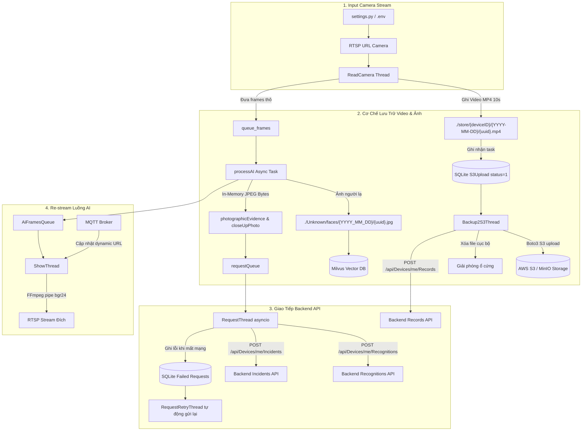

# HỆ THỐNG DIGITAL CITY - TÀI LIỆU CẤU HÌNH, LƯU TRỮ VÀ API

Tài liệu này mô tả chi tiết cơ chế hoạt động liên quan đến **Cấu hình (`settings.py`)**, **Luồng dữ liệu**, **Chiến lược lưu trữ ảnh/video** và **Giao tiếp API với Backend Server** của hệ thống Edge AI Box / Digital City.

---

## 1. Tổng Quan Kiến Trúc Luồng Dữ Liệu



---

## 2. Chi Tiết Cấu Hình Hệ Thống (`settings.py`)

Tất cả cấu hình được đọc từ file `.env` hoặc sử dụng giá trị mặc định:

| Biến cấu hình | Giá trị mặc định | Giải thích ý nghĩa |
| :--- | :--- | :--- |
| `TOKEN` | *(Từ `.env`)* | Bearer Token xác thực quyền thiết bị với Backend (`X-Auth-Token`). |
| `SERVER_URL` | `https://hgdc-ios-api.dev.altasoftware.vn/` | Địa chỉ API Backend xử lý nghiệp vụ Digital City. |
| `MAC_ID` | Auto get từ hardware | Mã định danh phần cứng (MAC Address) dùng để đăng ký và xác thực camera. |
| `IP_CAMERA` | *(Từ `.env`)* | Địa chỉ IP của camera giám sát. |
| `TK_CAMERA` / `PASSWORD_CAMERA` | *(Từ `.env`)* | Tài khoản / Mật khẩu đăng nhập vào camera IP. |
| `EXTEND_RSTP_LINK` | `/MediaInput/h264/stream_1` | Đường dẫn sub-stream/main-stream RTSP của camera IP. |
| `AWS_ACCESS_KEY` / `AWS_SECRET_KEY` | *(Từ `.env`)* | Thông tin chứng thực truy cập dịch vụ lưu trữ đám mây S3/MinIO. |
| `BUCKET_NAME` | `haugiang` | Tên Bucket S3 để upload video ghi hình. |
| `PUBLIC_URL` | `https://alta-s3.dev-altamedia.com:443` | Endpoint S3 Server (hỗ trợ AWS S3 hoặc MinIO Self-hosted). |
| `WIDTH_EVIDENCE_FRAME` | `1920` | Chiều rộng chuẩn của ảnh bằng chứng toàn cảnh (Full evidence photo). |
| `HEIGHT_EVIDENCE_FRAME` | `1080` | Chiều cao chuẩn của ảnh bằng chứng toàn cảnh. |
| `PHOTO_QUALITY` | `50` | Mức nén chất lượng ảnh JPEG (0 - 100), cân bằng chất lượng và băng thông. |
| `MAXTIMESAVE` | `168` (giờ) | Thời gian tối đa lưu trữ video chờ upload trước khi hệ thống tự động xóa bản ghi cũ nhất (tránh tràn đĩa cứng). |
| `incidentDuration` | `1` (giây) | Chu kỳ gom nhóm (batching) các sự kiện vi phạm trước khi gửi một lần lên Backend. |
| `MAX_RETRIES` | `4` | Số lần thử lại tối đa cho các request API bị lỗi mạng. |
| `ACTIVATE_PROOF` | `False` | Bật/Tắt việc ghi video MP4 bằng chứng riêng cho từng đối tượng bám vết. |

---

## 3. Cơ Chế Lưu Trữ Ảnh & Video

Hệ thống phân tách rõ ràng thành **3 tầng lưu trữ** nhằm tối ưu hóa bộ nhớ thiết bị Edge:

### 3.1. Phân đoạn Video 10 giây (Continuous Recording -> AWS S3)

- **Thư mục cục bộ:** `./store/{deviceID}/{YYYY-MM-DD}/{uuid}.mp4`
- **Quy trình hoạt động:**
  1. Luồng `ReadCamera` ghi nhận luồng hình ảnh liên tục từ camera IP.
  2. Mỗi khi đủ thời lượng 10 giây (`durationVideo = 10`), video được hoàn tất ghi xuống đĩa cứng bằng `cv2.VideoWriter`.
  3. Một bản ghi mới được tạo vào cơ sở dữ liệu SQLite cục bộ qua ORM model `S3Upload`:
     - `file_path`: Đường dẫn file video cục bộ.
     - `s3_key`: Đường dẫn file đích trên S3 (ví dụ: `{deviceID}/2026-09-24/{uuid}.mp4`).
     - `status = 1`: Trạng thái chờ đẩy lên Cloud.
     - `starttime`, `endtime`, `duration`: Timestamp bắt đầu và kết thúc của video.
  4. Luồng `Backup2S3Thread` quét cơ sở dữ liệu:
     - Dùng `boto3` gọi `upload_to_s3()` đẩy video lên S3/MinIO.
     - **Giải phóng bộ nhớ:** Ngay sau khi upload thành công, lệnh `os.remove(videoPath)` được thực thi để xóa file MP4 khỏi ổ cứng thiết bị.
     - Gọi API thông báo cho Backend Server danh sách các video đã sao lưu thành công.

### 3.2. Ảnh bằng chứng sự kiện (In-Memory Buffer -> Gửi thẳng API)

- **Vị trí lưu:** **Lưu trữ trực tiếp trên RAM (Memory Buffer)**, không ghi ra đĩa cứng để loại bỏ độ trễ I/O đĩa.
- **Quy trình đóng gói:**
  1. **Ảnh toàn cảnh (`photographicEvidence`):**
     - Frame từ camera được resize về kích thước chuẩn `1920x1080` (`WIDTH_EVIDENCE_FRAME x HEIGHT_EVIDENCE_FRAME`).
     - Nén định dạng JPEG với chất lượng `PHOTO_QUALITY = 50` bằng hàm `compress_image()`.
     - Chuyển thành chuỗi byte nhị phân qua `img2bytes()` (`cv2.imencode('.jpg')`).
  2. **Ảnh cận cảnh (`closeUpPhoto`):**
     - Vùng crop đối tượng (khuôn mặt hoặc biển số xe) từ frame gốc có độ phân giải cao được chuyển đổi thành chuỗi byte JPEG.
  3. Cả hai dữ liệu byte này được đóng gói trong đối tượng JSON sự kiện và đẩy vào hàng đợi bất đồng bộ `requestQueue`.

### 3.3. Ảnh khuôn mặt chưa định danh (Unknown Faces)

- **Thư mục cục bộ:** `./Unknown/faces/{YYYY_MM_DD}/{uuid}.jpg`
- **Quy trình hoạt động:**
  - Khi phát hiện một khuôn mặt người lạ (chưa tồn tại trong hệ thống so khớp vector Milvus), ảnh crop mặt chất lượng cao sẽ được ghi xuống đĩa cứng qua lệnh `cv2.imwrite()`.
  - Đường dẫn file này cùng với vector đặc trưng khuôn mặt (embedding) được lưu vào Milvus Collection `REPOSITORY_UNIDENTIFIED` để phục vụ công tác tra cứu, quản lý sau này.

---

## 4. Cơ Chế Giao Tiếp API Với Backend

Tất cả các kết nối gửi dữ liệu lên Backend được đảm nhiệm độc lập bởi luồng bất đồng bộ `RequestThread` sử dụng `aiohttp`, đảm bảo không gây block hay làm sụt giảm FPS của luồng camera.

### 4.1. Xác thực thiết bị (`verifyDevice`)

- **Endpoint:** Gọi kiểm tra địa chỉ phần cứng `MAC_ID` với Backend khi ứng dụng vừa khởi động.
- **Xử lý:** Nếu mã MAC chưa được cấp phép hoặc trùng lặp với thiết bị khác, ứng dụng lập tức thoát (`os._exit(1)`).

### 4.2. API Lưu trữ bản ghi Video (`POST /api/Devices/me/Records`)

- **Header:** `{"X-Auth-Token": TOKEN, "Content-Type": "application/json"}`
- **Payload:**
  ```json
  {
    "recordings": [
      {
        "path": "deviceID/2026-09-24/34a02c918ef1411295b9ba0ad0be0b21.mp4",
        "startTime": 1774320000000,
        "endTime": 1774320010000,
        "duration": 10000
      }
    ]
  }
  ```
- **Ý nghĩa:** Thông báo cho Backend biết video 10 giây đã được tải lên S3 an toàn, cung cấp đường link S3 key để Backend có thể xem lại video giám sát lịch sử.

### 4.3. API Nhận diện định kỳ (`POST /api/Devices/me/Recognitions`)

- **Tần suất:** Gom gửi mỗi 10 giây/lần.
- **Dạng dữ liệu:** JSON thuần (`application/json`).
- **Nội dung:** Chứa danh sách các đối tượng nhận diện trong khung hình (`trackingId`, `code`, tọa độ bounding box, `time`, loại đối tượng `type`).

### 4.4. API Báo cáo sự kiện & Vi phạm (`POST /api/Devices/me/Incidents`)

- **Dạng dữ liệu:** `multipart/form-data`
- **Cơ chế hoạt động:**
  1. Các sự kiện trong `requestQueue` được gom nhóm theo chu kỳ `incidentDuration` (1 giây).
  2. Hàm `json2formdata()` chuyển đổi cấu trúc JSON lồng nhau thành các trường Form Data:
     - Trường metadata: `sessionId`, `startTime`, `endTime`, `type`, `boxes`, `recognitionOutcomes`...
     - Trường file đính kèm: Bất kỳ trường nào có tên kết thúc bằng `photographicEvidence` hoặc `closeUpPhoto` sẽ được đóng gói thành file ảnh JPEG upload (`filename="{uuid}.jpg"`, `content_type="image/jpeg"`).
  3. Gửi đồng loạt bằng `asyncio.gather(*tasks)` để tiết kiệm tài nguyên mạng.

### 4.5. Cơ chế Xử Lý Sự Cố Mạng (Failover & Retry)

- Khi gọi API thất bại (Timeout sau 50 giây hoặc mã lỗi HTTP 5xx / lỗi mạng), hàm `log_failed_request()` sẽ lưu toàn bộ payload request vào bảng cơ sở dữ liệu SQLite cục bộ.
- Luồng nền `RequestRetryThread` định kỳ kiểm tra các request bị treo trong cơ sở dữ liệu và thử gửi lại tối đa `MAX_RETRIES` lần trước khi đánh dấu thất bại vĩnh viễn, đảm bảo không bị thất thoát dữ liệu sự kiện khi mạng không ổn định.
